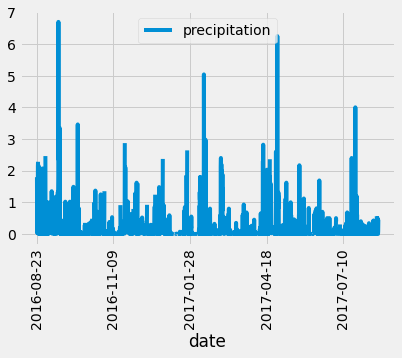

#sqlalchemy-challenge
Dependencies
pandas module in Python
SQLAlchemy module in Python
Flask

## OVERVIEW

I am taking a trip to Hawaii and have decided to do some analysis based off of some climate 
data found in a SQLite database. The following analyses were done:

Using SQLAlchemy to reflect existing databases to classes in Python

## PRECIPITATION ANALYSIS

Using queries to retrieve the last 12 months of precipitation data and 
  plotting them over time using a pandas DataFrame

## STATION ANALYSIS

Designing queries to obtain the total number of stations, the most active stations, and the last 12 months of temperature observation data (summarized as a histogram).  Creating a Flask API app to create routes that retrieve JSON data such as precipitation values by date, stations, temperature observations from the last year, and min, max, and average temperatures within a specified date range.

##  CLIMATE APP

SEE APP.PY FILE to view routes

## TEMPERATURE ANALYSIS

Test if June and December temperature observations were significantly different using a t-test

Plotting the average temperature and the min/max range as a bar chart for my chosen trip date (4/10/2014-4/22/2014) based off of the previous year's corresponding date

## DAILY RAINFALL AVERAGE

Daily rainfall average based off of historical data for my chosen date range

An additional side analysis was also done to justify why a line plot may not always be the best choice for dealing with certain datasets.

## OUTPUT

